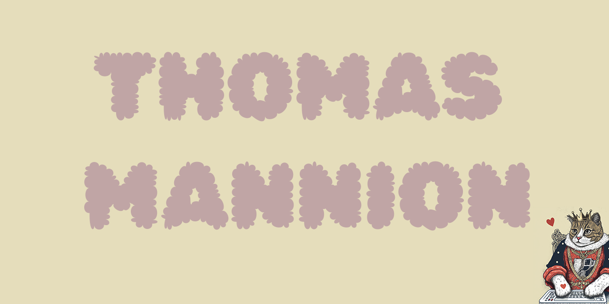

[About me](#about_me) | [Skills](#skills) | [Pinned projects](#pinned) | [Skills](#skills) | [Education](#education) | [Experience](#experience) | [Interests](#interests)

<h1>Hi 👋, I'm Thomas Mannion</h1>

## <a name="about_me">About me 😄</a>

<h3>A coffee nerd who loves Java...Script.</h3>

 

I am a perseverant and enthusiastic Full Stack developer looking to transition from my current career in the coffee industry.
 
I previously studied Computer Science at Durham University but felt at the time I needed more confidence to be industry-ready. Having completed Makers Bootcamp recently, I have grown into a competent coder with a growth mindset ready to tackle any project.
 

Aspiring to be a part of a company that is as much about people as it is tech, I believe that my unique blend of customer service and technical knowledge can help them achieve their goals.

 

## <a name="skills"> 💼 Skills</a>

 

  
More Skills :sparkles:

 

 

 

 

## <a name="pinned"> 📌 Pinned Repositories</a>

 

| Project                                                                                                                                                                                                                                                                                                 |                                                Tech stack                                                |                                                                                                                       Live link |
| ------------------------------------------------------------------------------------------------------------------------------------------------------------------------------------------------------------------------------------------------------------------------------------------------------- | :------------------------------------------------------------------------------------------------------: | ------------------------------------------------------------------------------------------------------------------------------: |
|  | <ul><li>Express</li><li>React</li><li>Bootstrap</li><li>Mongoose</li><li>Jest</li><li>Cypress </li></ul> |  |
|         |        <ul><li>Express</li><li>Handlebars</li><li>Mongoose</li><li>Jest</li><li>Cypress</li></ul>        |   |

 

## <a name="skills">:brain: What I bring to the table (Skills)</a>

#### Effective communication

- Promoted to head of coffee training at Kafi (London :gb:).
- Established a food waste reduction scheme by connecting Elysian Coffee and Atira Women's Shelter (Vancouver :canada:).
- Campaigned and was elected as the Social Secretary at Durham University Breakdance Society (Durham :gb:).

#### Adaptive problem solving

- Founded and managed a dog-walking business to support myself financially in Lund (Lund :sweden:).
- Learned basic Cantonese within a month to secure employment at Twins Kitchen as an Events Coordinator and Barista (Hong Kong :hong_kong:).
- Self-taught React in 8 days during Makers Bootcamp to create [Less waste more taste](https://less-waste-more-taste.herokuapp.com/) (London :gb:).

#### Meticulous organisation

- Created a coffee spreadsheet at Elysian Coffee to track espresso extraction against coffee roast date (Vancouver :canada:).
- Fine-tune the espresso everyday to ensure consistency (Coffee TDD? :coffee:) (:earth_asia:).

 

## <a name="education">:open_book: Where I've been learning (Education)</a>

#### [Makers Academy](https://makers.tech/) (July to November 2022)

Full-time software development course focusing on:

- Utilising test-driven design.
- Object-Oriented Programming and design principles.
- Model View Controller design patterns.
- Web frameworks, version control, and CI/CD to create full-stack web apps.
- GitHub group and individual workflow.
- Effective pair-programming.
- Agile principles, sprint planning, and productive retros.

#### [Durham University](https://www.durham.ac.uk/homepage/) (September 2013 to July 2016)

- Computer Science (Diploma of higher education)

 

## <a name="experience">:technologist: What I've been up to? (Experience) </a>

#### [Kafi](https://www.kaficafe.com/) - London (December 2020 to Current)

Senior barista

- Lead training of coffee fundamentals for junior staff members.
- Design recipes for the store's menu.
- Contributed to the setup of a second location.

#### [Elysian Coffee](https://elysiancoffee.com/) - Vancouver (August 2019 to September 2020)

Senior barista

- Proposed and implemented a food waste reduction scheme with Atira Women’s shelter.
- Gained coffee roasting knowledge.

#### [Twins Kitchen](http://www.twins-kitchen.com/) - Hong Kong (January 2018 to September 2019)

Barista / Events coordinator

- Coordinated events for brands such as Moleskine, Loewe, and Origins.

 

## <a name="interests">:climbing: Other things I also enjoy! (Interests) </a>

- Sewing, like coding, lets me plan and see all the pieces come together into one finished product.
- Climbing gives me something to look forward to; meeting friends and pushing each other to do better keeps me coming back!

 

## &#x1f4c8; GitHub Stats

 

 
